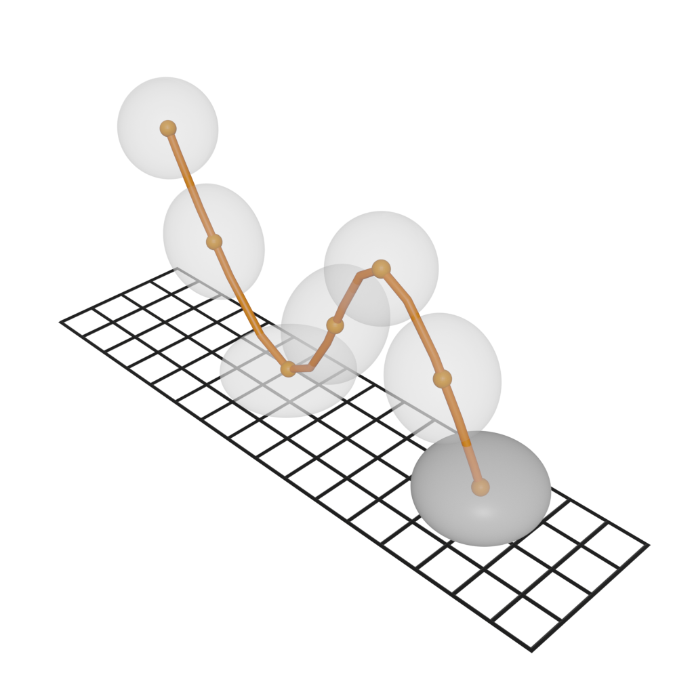
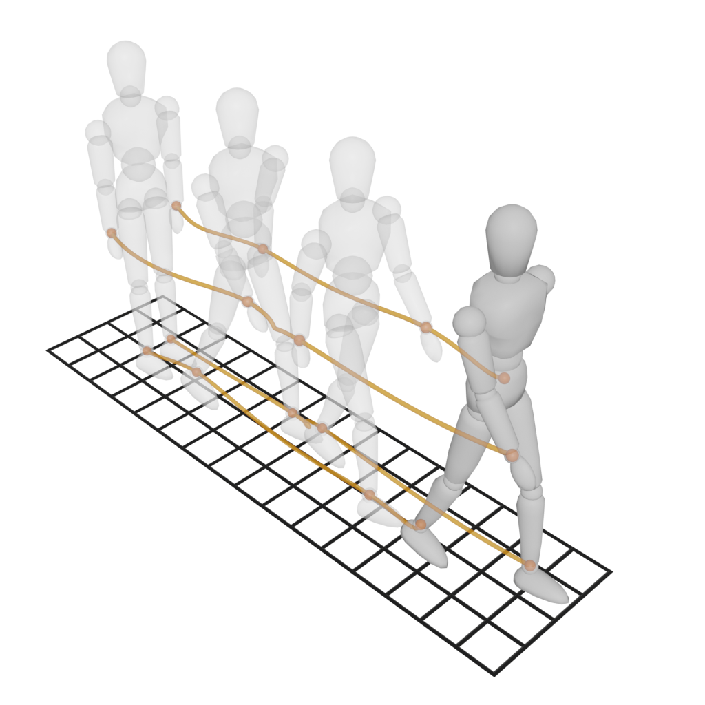
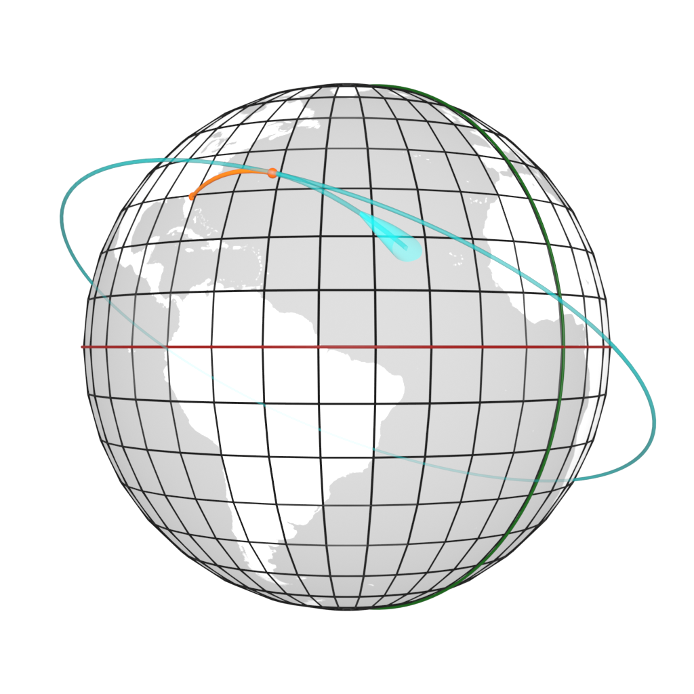

## Animation

[options="header"]
|===
| Term | Representation | Definition
| **Animation** |  link:https://github.com/opengeospatial/GeoPoseGuides/blob/main/users_guide/figures/glossary/Animation.blend[Animation.blend] | **"Animation is a method to create the illusion of movement through a collection of still images."**

In computer graphics, animation is generally simulated by modifying the properties of an object (including its position, rotation, scale, material colors, etc.) over a period of time (or timeline). Since complex deformations require a large number of physics calculations, most animation systems either operate with properties independently (i.e, separating position, orientation and scale) or define skeleton-based systems to alter the geometry of the object in a controllable way. In recent years, however, many 3D engines incorporate procedural subsystems to simulate advanced animations (such as explosions, wind systems, collision deformations, etc) in real-time, with relatively high degree of precision.

Internally, each change in properties is stored into an "animation key", and when there is more than one key over time, an "animation curve" is generated to specify how to interpolate between them. A collection of curves is called an "animation clip" and can be associated to a given action or event.
| **Motion** | 
https://github.com/opengeospatial/GeoPoseGuides/blob/main/users_guide/figures/glossary/Motion.blend[Motion.blend] | **"A Motion is a type of Animation that only defines the movement (position+orientation keys) of objects."**

In many use cases, it is possible to simplify complex animations by segmenting an object (generally, using a skeleton structure) and reducing the types of keys to just position and orientation (creating animation curves known as Motion Paths). This idea of only taking into consideration the movement of different parts of an object is the basis of link:https://en.wikipedia.org/wiki/Motion_capture[motion capture] techniques; a series of technologies that, nowadays, can even https://en.wikipedia.org/wiki/Facial_motion_capture[record subtle facial expressions of human beings].

Another interesting point of view is that motions can also be defined as transitions between different poses of an object. In this way, instead of having to define a single sequence of animation keys, it is possible to "jump" between different poses by merely interpolating between them whenever necessary (something especially useful when dealing with real-time camera -motion- tracking systems).

It is important to note that a motion between two poses also generates a direction vector and an attitude (orientation relative to that direction vector). 

| **Trajectory** | 
link:https://github.com/opengeospatial/GeoPoseGuides/blob/main/users_guide/figures/glossary/Trajectory.blend[Trajectory.blend] | **"A trajectory is a precalculated Motion Path that attempts to describe the future movement of an object."**

While motion paths describe the actual movements over time, in many use cases it is imperative to also be able to predict the future movement of an object (e.g., to avoid collisions or reach a location/orbit with a very specific speed and orientation). These special motion paths are called *Trajectories* and are usually calculated by simply taking into consideration the inertia of an object.

This is especially important for objects placed in a stable trajectories relative to others objects (usually, astronomical bodies), because if those trajectories are entirely predictable, it is possible to create an link:https://en.wikipedia.org/wiki/ephemeris[Ephemeris] system to rapidly calculate their position at any point in time. Additionally, if a predictable trajectory is regularly repeated over time, it can also be called a stable link:https://en.wikipedia.org/wiki/Orbit[Orbit].
| **Gesture** | image:../users_guide/figures/glossary/Gesture.png[Gesture]
link:https://github.com/opengeospatial/GeoPoseGuides/blob/main/users_guide/figures/glossary/Gesture.blend[Gesture.blend] | **"A Gesture is a *Pose* or *Motion* used to convey a non-vocal message."**

Gestures are a form of communication that involve the positioning/movement of a part of the body in a predetermined way to express a particular concept. And although this type of communication is used by many living beings, humans have used them to develop complete sign languages or to serve as a method of identification. Some basic gestures even allow people to overcome linguistic barriers and create a culture around specific gestures.

Nevertheless, since messages conveyed by gestures require both the issuer to be able to make the gestures and the receiver to be able to interpret them correctly, both the communication channel (the physical space) and the meaning of each gesture has to be previously defined to avoid misunderstandings.

It is important to clarify that gestures can also be conveyed by a visual representations (e.g., the Unicode symbol U+1F44C "👌") or with robotic systems that emulate the body structure and movements of the living beings (which is one of the basis of the Animal-Robot Interaction field).
