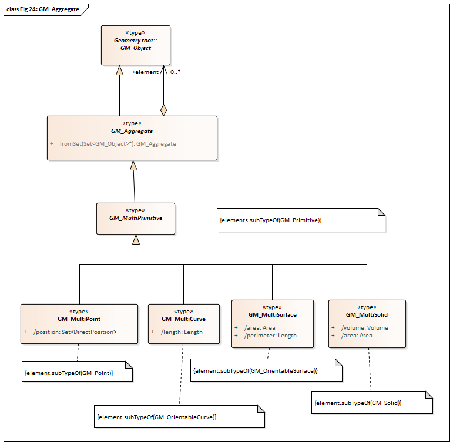

[[ug-model-core-section]]
=== Core

|===
^|*Contributors*
|C. Heazel - first draft
|===

NOTE: in this example this module is first divided into multiple sections. This is done to make the concept more accessible.

The CityGML Core module defines the basic concepts and components of city models. This rather large body of work is divided into seven sections. These sections build on each other from the fundamental principles specified by the relevant ISO standards up to the full CityGML model. These sections are summarized in <<citygml-core-table>>.

[[citygml-core-table,Table {counter:table-num}]]
.CityGML Core Sections
[width="90%",cols="2,6"]
|===
|<<ug-key-concepts-section,Key Concepts>> |Summarizes the key concepts described in the Core module.
|<<ug-iso-dependencies-section,The Use of ISO Standards>> |Describes the use of the ISO 19100 series of International Standards to provide a foundation to the CityGML model.
|<<ug-city-objects-section,City Models and City Objects>>|Defines the basic building blocks of the CityGML model.
|<<ug-space-concepts-section,Space Concept>>|Defines the concepts of space as used in the CityGML model.
|<<ug-geometry-lod-section,Geometry and LOD>>|Defines the geometry and Levels Of Detail concepts.
|<<ug-core-uml-section,CityGML Core Model>>|Presents the complete Core model.
|<<ug-core-b-e-c-section,Types, Enumerations, and Codelist>> |Defines the little things which make this model work.
|===

[[ug-key-concepts-section]]
==== Key Concepts

The following is a summary of the key concepts described by the Core Module. This is not an exaustive listing of all of the Core concepts. Rather, it is an introduction those concepts which are essentiall for understanding the role of the Core Module in the CityGML Conceptual Model. 

[[city-model-concept]]
<<CityModel-section,*CityModel*>>: (<<ug-city-model-section,Discussion>>) The CityModel class is the root class of every CityGML conceptual model. It's primary purpose is to aggregate CityModelMembers.

NOTE: Each entry includes a link to the corresponding data dictionary (click on the name) and a link to further discussion of the concept (discussion). Furthermore, each concept has an anchor which makes it a potential target of an interal link.

[[ug-iso-dependencies-section]]
==== ISO Dependencies

NOTE: these classes are commonly used in OGC standards. I left the content in case you have a use for it.

CityGML builds on the ISO 19100 family of standards. The applicable standards are identified in <<ISO-in-CityGML-diagram>>. A <<ISO-classes-dd,Data dictionary>> is also included for all of the ISO-defined classes explicitly referenced in the CityGML UML model. These data dictionaries are provided for the convenience of the user. The ISO standards are the normative source.

[[ISO-in-CityGML-diagram,Figure {counter:figure-num}]]
.Use of ISO Standards in CityGML
/// image::../standard/figures/Core/ISOandOASISstandardsinCityGML.png[align="center"]

[[ug-iso-classes-section]]
*Classes*

The ISO classes explicitly used in the CityGML UML model are introduced in <<iso-class-table>>. Detailed descriptions are provided in the  <<ISO-classes-dd,Data Dictionary>>.

[[iso-class-table,Table {counter:table-num}]]
.ISO Classes used in CityGML
[cols="2,6",options="headers"]
|===
^|*Class Name* ^|*Description*
|<<AnyFeature-section,AnyFeature>> |[[anyfeature-concept]] A generalization of all feature types
|<<CV_DiscreteGridPointCoverage-section,CV_DiscreteGridPointCoverage>> |[[cv_discrete-grid-point-coverage-concept]]A coverage that returns the same feature attribute values for every direct position within any object in its domain.
|<<DirectPosition-section,DirectPosition>> |[[direct-position-concept]]The coordinates for a position within some coordinate reference system.
|<<GM_Object-section,GM_Object>> |[[gm_object-concept]]The root class of the geometric object taxonomy.
|<<GM_MultiCurve-section,GM_MultiCurve>> |[[gm_curve-concept]]An aggregate class containing only instances of GM_OrientableCurve.
|<<GM_MultiPoint-section,GM_MultiPoint>> |[[gm_multipoint-concept]]An aggregate class containing only points.
|<<GM_MultiSurface-section,GM_MultiSurface>> |[[gm_multisurface-concept]]An aggregate class containing only instances of GM_OrientableSurface.
|<<GM_Point-section,GM_Point>> |[[gm_point-concept]]The basic data type for a geometric object consisting of one and only one point.
|<<GM_Solid-section,GM_Solid>> |[[gm_solid-concept]]The basis for 3-dimensional geometry. The extent of a solid is defined by the boundary surfaces.
|<<GM_Surface-section,GM_Surface>> |[[gm_surface-concept]]The basis for 2-dimensional geometry.
|<<GM_Tin-section,GM_Tin>> |[[gm_tin-concept]]A GM_TriangulatedSurface which uses the Delaunay or similar algorithm.
|<<GM_TriangulatedSurface-section,GM_TriangulatedSurface>> [[gm_triangulated-surface-concept]]|A GM_PolyhedralSurface that is composed only of triangles
|<<SC_CRS-section,SC_CRS>> |[[sc_crs-concept]]Coordinate reference system which is usually single but may be compound.
|<<TM_Position-section,TM_Position>> |[[tm_position-concept]]A union class that consists of one of the data types listed as its attributes.
|===

[[ug-iso-geometry-section]]
*Geometry*

The most common geometry concept found in the CityGML 3.0 Standard is the concept of <<ug-gm_multiprimitive-section,multi-primitives>>. These are homogeneous collections of <<ug-gm_primitive-section,GM_Primitives>> which are aggregated to form a more compex geometry. 

<<ug-gm_composite-section,GM_Composites>> are another form of <<ug-gm_primitive-section,GM_Primitive>> collection. These differ from <<ug-gm_multiprimitive-section,GM_MultiPrimitive>> in that the collection can be heterogeneous. It should be  noted that none of the classes in the CityGML 3.0 Standard are decended from <<ug-gm_composite-section,GM_Composites>>. However, the terms "CompositeCurve", "CompositeSurface", and "CompositeSolid" do appear in the text. The `composit` concept can also be seen in the assocation between spaces and surfaces. Therefore, an explanation of `composits` has been included for completeness.

[[ug-gm_primitive-section]]
===== GM_Primitive

GM_Primitive is the abstract root class of the geometric primitives. Its main purpose is to define the basic "boundary" operation that ties the primitives in each dimension together. A geometric primitive (GM_Primitive) is a geometric object that is not decomposed further into other primitives in the system. This includes curves and surfaces, even though they are composed of curve segments and surface patches, respectively. This composition is a strong aggregation: curve segments and surface patches cannot exist outside the context of a primitive.

NOTE Most geometric primitives are decomposable infinitely many times. Adding a centre point to a line may split that line into two separate lines. A new curve drawn across a surface may divide that surface into two parts, each of which is a surface. This is the reason that the normal definition of primitive as "non-decomposable" is not plausible in a geometry model - the only non-decomposable object in geometry is a point.

[[ug-gm_multiprimitive-section]]
===== GM_MultiPrimitive

Any geometric object that is used to describe a feature is a collection of <<ug-gm_primitive-section,geometric primitives>>. A homogeneous collection of geometric primitives may be a multi-primitive (GM_MultiPrimitive). Geometric complexes have additional properties specific to the type of <<ug-gm_primitive-section,geometric primitive>> they aggregate.

[[gm_aggregate-figure,Figure {counter:figure-num}]]
.GM_MultiPrimitive Context Diagram

[[ug-gm_complex-section]]
===== GM_Complex

A GM_Complex is a set of disjoint geometric primitives (<<ug-gm_primitive-section,GM_Primitive>>) such that the boundary of each primitive can be represented as the union of other geometric primitives within the complex.

Any geometric object that is used to describe a feature is a collection of <<ug-gm_primitive-section,geometric primitives>>. A collection of geometric primitives may be a geometric complex (GM_Complex). Geometric complexes have additional properties such as closure by boundary operations and mutually exclusive component parts.

[[gm_complex-figure,Figure {counter:figure-num}]]
.GM_Complex Context Diagram
image::figures/GM_Complex.png[align="center"]

<<ug-gm_primitive-section,GM_Primitive>> and GM_Complex share most semantics, in the meaning of operations, attributes and associations. There is an exception in that a GM_Primitive shall not contain its boundary (except in the trivial case of GM_Point where the boundary is empty), while a GM_Complex shall contain its boundary in all cases. This means that if an instantiated object implements GM_Object operations both as GM_Primitive and as a GM_Complex, the semantics of each set theoretic operation is determined by the its name resolution. Specifically, for a particular object such as GM_CompositeCurve, GM_Primitive::contains (returns FALSE for end points) is different from GM_Complex::contains (returns TRUE for end points). Further, if that object is cast as a GM_Primitive value and as a GM_Complex value, then the two values need not be equal as GM_Objects.

GM_Complex aggregates GM_Primitives through the `element` property. Since this is an aggregation, the target GM_Primitive may be associated with more than one GM_Complex.

A GM_Complex object can also have a whole/part relationship with other GM_Complex objects. The `contains` association is used to associate the `superComplex` instance with the `subComplex` instance.

Note that the geometric primitives in the set are mutually exclusive in the sense that no point is interior to more than one primitive.  The set is closed under boundary operations, meaning that for each element in the complex, there is a collection (also a complex) of geometric primitives that represents the boundary of that element.

[[ug-gm_composite-section]]
===== GM_Composite

GM_Composite is a subclass of <<ug-gm_complex-section,GM_Complex>>. Like <<ug-gm_complex-section,GM_Complex>>, it has an association with <<ug-gm_primitive-section,GM_Primitives>>. In this case this is an `composition` association with a `composite` role (GM_Composite) and a `generator` role (GM_Primitive). As with the GM_Complex, the GM_Primitve may be associated with more than one GM_Composite.

[[gm_composite-figure,Figure {counter:figure-num}]]
.GM_Composite Context Diagram
image::figures/GM_Composite.png[align="center"]

[[ug-gm_composite-surface-section]]
===== GM_CompositeSurface

A GM_Composite where the <<ug-gm_primitive-section,GM_Primitives>> is a <<ug-gm_orientable-surface-section,GM_OrientatableSurface>>.

A GM_CompositeSurface is also a subclass of <<ug-gm_primitive-section,GM_Primitives>> is a <<ug-gm_orientable-surface-section,GM_OrientatableSurface>>. One of the few examples of multiple inheritance.

[[gm_composite-surface-figure,Figure {counter:figure-num}]]
.GM_CompositeSurface Context Diagram
image::figures/GM_CompositeSurface.png[align="center"]

[[ug-gm_orientable-surface-section]]
===== GM_OrientatableSurface

GM_OrientableSurface consists of a surface and an orientation inherited from GM_OrientablePrimitive. If the orientation is "+", then the GM_OrientableSurface is a GM_Surface. If the orientation is "-", then the GM_OrientableSurface is a reference to a GM_Surface with an upNormal that reverses the direction for this GM_OrientableSurface, the sense of "the top of the surface" (see 6.4.33.2).

  GM_OrientableSurface: 
  {Orientation = "+" implies primitive = self}; 
  {(Orientation = "-" and TransfiniteSet::contains(p : DirectPosition)) implies (primitive.upNormal(p) = - self.upNormal(p))};

[[ug-gm_composite-curve-section]]  
===== GM_CompositeCurve

A GM_CompositeCurve is a list of geometric curves such that the each geometric curve in the set terminates at the start point of the subsequent curve in the list

The `generator` is a GM_OrientableCurve. 

A GM_CompositCurve is also a subclass of GM_OrientatableCurve. One of the few examples of multiple inheritance.

[[gm_composite-curve-figure,Figure {counter:figure-num}]]
.GM_CompositeCurve Context Diagram
image::figures/GM_CompositeCurve.png[align="center"]

[[ug-gm_orientable-curve-section]]
===== GM_OrientatableCurve

GM_OrientableCurve consists of a curve and an orientation inherited from GM_OrientablePrimitive. If the orientation is "+", then the GM_OrientableCurve is a <<ug-gm_curve-section,GM_Curve>>. If the orientation is "-", then the GM_OrientableCurve is related to another <<ug-gm_curve-section,GM_Curve>> with a parameterization that reverses the sense of the curve traversal.

  GM_OrientableCurve:
  {Orientation = "+" implies primitive = self}; +
  {Orientation = "-" implies primitive.parameterization(length()-s) = parameterization(s)};

[[ug-gm_composite-solid-section]]  
===== GM_CompositeSolid

A GM_CompositeSolid is a set of geometric solids adjoining one another along common boundary geometric surfaces.

The `generator` is a <<ug-gm_solid-section,GM_Solid>>. 

A GM_CompositSolid is also a subclass of <<ug-gm_solid-section,GM_Solid>>. One of the few examples of multiple inheritance.

[[gm_composite-solid-figure,Figure {counter:figure-num}]]
.GM_CompositeSolid Context Diagram
image::figures/GM_CompositeSolid.png[align="center"]

[[ug-city-objects-section]]
==== City Models and City Objects

///
This section provides informative text in support of your standard. Most standards have a "core" module which defines the basic functionality which all implementions must support. Informative text about that "core" modeule goes here.
///

[[ug-space-concepts-section]]
==== Space Concept

More core concepts

[[ug-geometry-lod-section]]
==== Geometry and LOD

And more concepts

[[ug-core-uml-section]]
==== CityGML Core UML Model

And finally the UML model.